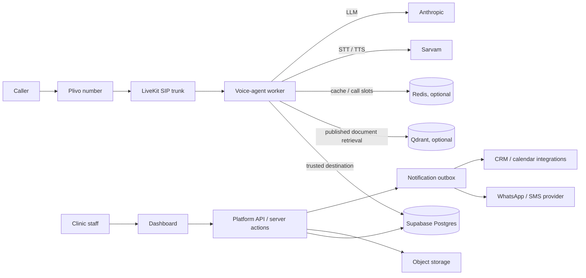

# Market readiness and clinic onboarding guide

> **Purpose:** convert the current voice-agent repository into a sellable, supportable
> clinic product. This guide distinguishes what is verified in this repository from
> work the platform/fullstack, operations and customer-success teams must complete.
>
> **Scope:** administrative clinic reception only. The product must not diagnose,
> triage, interpret test results, prescribe or provide treatment advice.
>
> **Status key:** ✅ Done and evidenced in this repository · 🟡 Partly done or requires
> live verification · ⬜ Pending / owned outside this repository · ⛔ Release blocker.

## 1. Executive launch decision

| Launch level | Status | Meaning | Required decision |
| --- | --- | --- | --- |
| Internal development demo | 🟡 | Console and worker code exist, but console requires a published dev clinic. | Use only test data and isolated credentials. |
| Controlled telephone pilot | 🟡 | Voice runtime is tested offline, but production database contract and live SIP checks remain. | Run after every ⛔ item in section 3 is closed. |
| Paid clinic onboarding | ⬜ | Requires a platform dashboard, staff workflows, support, legal/operational controls and monitoring. | Do not promise this level yet. |
| Broad production rollout | ⬜ | Requires repeatable tenant provisioning, incident response and measured pilot success. | Review after pilot exit criteria pass. |

## 2. What exists now

### 2.1 Voice runtime

| Capability | Status | Current behaviour / evidence |
| --- | --- | --- |
| Inbound call path | ✅ | Plivo → SIP trunk → LiveKit → `inbound-agent`. See the repository README for run and deployment commands. |
| Tenant resolution | ✅ | The trusted SIP trunk ID and called number resolve the clinic; caller ID and caller speech cannot choose one. |
| Published configuration pinning | ✅ | Each call loads one immutable published snapshot and retains it for the call. |
| Administrative knowledge | ✅ | Searches reviewed/published facts and documents; schedule precedence is calculated in structured code. |
| Slots and booking | 🟡 | Lists available slots and writes calendar bookings through platform SQL functions; conflict constraint is still required. |
| Callback capture | 🟡 | Encrypts caller name/phone and creates a callback request when a durable call record exists. |
| Safety routing | ✅ | Emergency wording is spoken before the LLM; medical and prompt-injection requests are guarded. |
| Hindi / English handling | 🟡 | Sarvam STT auto-detect and language-aware TTS are wired; verify accuracy and switching in live calls. |
| PII protection | ✅ | AES-GCM encryption for persisted names and phone numbers, restricted database role, masking in logs. |
| Recording and transcripts | ✅ | Not stored by this worker; keep recording disabled until consent, retention and access controls exist. |
| Retrieval isolation | ✅ | Snapshot and Qdrant queries are scoped to clinic and configuration version. |
| Runtime tests | ✅ | Offline lint, type checks and 160 automated tests passed during the last verification. Live-system tests remain pending. |

### 2.2 Platform boundary

The agent is deliberately **not** the staff web application or an HTTP API. It uses the
restricted `clinic_runtime` PostgreSQL role and the SQL-function interface in
[schema-contract.md](schema-contract.md). The fullstack platform owns the parts below.

| Platform responsibility | Status | Why it is needed |
| --- | --- | --- |
| Supabase schema and migrations | ⛔ | Creates tenants, numbers, published snapshots, requests, calls and bookings. |
| Staff authentication and RBAC | ⛔ | Ensures a receptionist can only see their clinic. |
| Dashboard / admin API | ⛔ | Lets staff manage facts and act on callbacks/bookings. |
| Configuration publishing | ⛔ | Validates drafts and creates immutable snapshots for new calls. |
| Document upload and approval | ⬜ | Prevents unreviewed documents from becoming caller-facing knowledge. |
| Notification sender | ⬜ | Delivers booking/callback notifications from the platform outbox. |
| Data retention / deletion jobs | ⬜ | Enforces each clinic's configured data lifecycle. |

## 3. Release blockers before a real clinic receives calls

All items in this section are required for a controlled pilot.

| # | Status | Owner | Required outcome | Acceptance evidence |
| --- | --- | --- | --- | --- |
| 1 | ⛔ | Platform / DB | Move the former migrations from commit `fbaae43` into the platform repo and apply them to an isolated production project. | Fresh environment can create two fictional clinics and pass tenant-isolation checks. |
| 2 | ⛔ | Platform / DB | Update `clinic_private.start_call` to accept `schema_version` 3 snapshots. | A real test call creates a durable call session, callback and usage rows. |
| 3 | ⛔ | Platform / DB | Prevent overlapping `calendar_bookings` using the documented exclusion constraint; map conflict SQLSTATE `23P01` to `taken`. | Concurrent booking test returns one booking and one `taken`, never two bookings. |
| 4 | ⛔ | Platform / Product | Make per-clinic concurrency limits configurable and align them with `CLINIC_MAX_CONCURRENT_CALLS`. | Limit is enforced consistently in Redis and Postgres. |
| 5 | ⛔ | Telephony / Ops | Configure the real inbound trunk: verified Plivo signalling IP allow-list and/or digest auth; map each real E.164 number to exactly one active clinic. | Unknown, inactive and cross-clinic destinations fail closed in a live test. |
| 6 | ⛔ | Security / Ops | Put all production secrets in managed secret storage, rotate any development credentials exposed during setup, and grant the worker only `clinic_runtime`. | Secret scan is clean; connection as owner/service role is rejected by the agent. |
| 7 | ⛔ | Product / Clinical governance | Obtain approved greeting, emergency wording, privacy/consent notices, languages, hours, fees and service descriptions from each pilot clinic. | A named clinic owner signs off on the published snapshot. |
| 8 | ⛔ | QA / Operations | Complete a real 50-call pilot. | Exit criteria in section 8 pass; defects are triaged and fixed. |

!!! warning "Current degraded mode"
    Until item 2 is complete, calls can still converse but `start_call` fails. That means
    there is no reliable call record, callback persistence or usage tracking. Do not
    onboard paying clinics in this state.

## 4. Recommended production architecture



### 4.1 API decision

**Do not add a public browser API to the agent worker.** The worker is a private,
long-running LiveKit process and should only use its restricted database contract.

Build a separate platform API (or authenticated server-side actions) for the dashboard.
It must derive `clinic_id` from the logged-in staff member, never accept it as trusted
browser input. Browser clients must never receive service-role credentials, PII keys or
the worker's database credentials.

Pseudo-code for every staff mutation:

```python
async def update_doctor(request, doctor_id, body):
    user = require_authenticated_user(request)
    clinic_id = await memberships.require_role(user.id, allowed={"owner", "manager"})

    # The URL/body cannot choose the tenant.
    doctor = await doctors.update(clinic_id=clinic_id, doctor_id=doctor_id, patch=body)
    await audit.append(actor=user.id, clinic_id=clinic_id, action="doctor.updated")
    return doctor
```

Pseudo-code for every agent database operation:

```sql
BEGIN;
SELECT set_config('app.clinic_id', :resolved_from_sip_destination, true);
SELECT clinic_private.start_call(...); -- SECURITY DEFINER, tenant scoped
COMMIT;
```

## 5. Platform and frontend build plan

### Phase A — Foundation and security

| Work item | Status | Done when |
| --- | --- | --- |
| Create separate platform repository/service | ⬜ | Deployment, migrations and dashboard are not coupled to the voice worker release. |
| Set up Supabase production and staging projects | ⬜ | Separate projects, backups, access owners, and restricted runtime roles exist. |
| Apply SQL contract and RLS | ⛔ | All functions in [schema-contract.md](schema-contract.md) work under `clinic_runtime`; cross-tenant tests pass. |
| Add staff auth and roles | ⬜ | Roles include platform admin, clinic owner, manager, receptionist and read-only viewer. |
| Audit logging | ⬜ | Every staff write has actor, clinic, action, resource and correlation ID. |
| Data policy implementation | ⬜ | Retention, export, correction and deletion workflows are approved and run safely. |

### Phase B — Minimum staff dashboard

Build this before onboarding a second clinic.

| Screen / API capability | Status | Minimum ship scope |
| --- | --- | --- |
| Clinic settings | ⬜ | Name, timezone, languages, greeting, emergency wording, data retention and supported contact channels. |
| Phone-number assignments | ⬜ | Show E.164 number, provider, trunk, status and clinic mapping; prevent duplicate active mappings. |
| Doctors and services | ⬜ | Add/deactivate, aliases, speciality, services, fees and effective dates. |
| Hours and exceptions | ⬜ | Weekly hours, holidays, doctor leave, temporary closures and validation of overlaps. |
| Notices and FAQs | ⬜ | Separate public text from internal notes; start/end times; review/publish/archive states. |
| Requests queue | ⬜ | Callback and booking statuses: new, contacted, confirmed externally, closed, cancelled. |
| Calls / review queue | ⬜ | Masked number, time, duration, intent/outcome, safety flags, tool failures, configuration version and usage. |
| Publication workspace | ⬜ | Draft → validate → preview → publish → rollback, with immutable published versions. |

### Phase C — Required backend endpoints

The implementation may use REST, RPC or server actions. The security boundaries matter
more than the transport. A minimal REST-shaped design is:

| Endpoint group | Status | Server rules |
| --- | --- | --- |
| `POST /auth/*` and session refresh | ⬜ | Supabase Auth/session protection, rate limits and CSRF protections appropriate to the UI stack. |
| `GET/POST/PATCH /clinics/current` | ⬜ | Clinic inferred from staff membership. Never accept a writable `clinic_id`. |
| `GET/POST/PATCH /doctors`, `/services`, `/locations` | ⬜ | Ownership check plus validation of effective dates/references. |
| `GET/POST/PATCH /schedules`, `/exceptions`, `/notices` | ⬜ | Detect conflicts; internal notes never enter a published snapshot. |
| `POST /configuration/preview`, `/publish`, `/rollback` | ⬜ | Transactional publish, schema validation, audit record and cache invalidation. |
| `GET/PATCH /requests` | ⬜ | Decrypt PII only for authorized clinic staff; record access/audit events. |
| `GET /calls`, `GET /usage`, `GET /health` | ⬜ | Mask PII by default; platform administrator sees only aggregate multi-clinic metrics. |
| `POST /documents`, `POST /documents/:id/review` | ⬜ | MIME/size checks, malware hook, extraction preview; no automatic publication. |

## 6. Third-party integration roadmap

### 6.1 Already wired into the worker

| Integration | Status | What remains before production |
| --- | --- | --- |
| LiveKit | 🟡 | Use a production project, worker supervision, deployment identity, alerts and live-room runbooks. |
| Plivo through SIP | 🟡 | Enforce trunk authentication/IP allow-list, number provisioning runbook and live failover testing. |
| Anthropic | 🟡 | Production key separation, spend caps, usage alerts, vendor/data-processing review and fallback incident procedure. |
| Sarvam STT/TTS | 🟡 | Confirm commercial plan, regional language quality, quota limits, voice choice and fallback procedure. |
| Supabase/Postgres | 🟡 | Platform schema/functions/RLS, backups, restore test, alerts and least-privilege roles. |
| Redis | 🟡 | Managed Redis, TLS/auth, sizing, eviction policy and cache invalidation on publication/number changes. |
| Qdrant | 🟡 | Managed instance or hardened deployment, persistent storage, snapshot backups, index lifecycle and relevance evaluation. |

### 6.2 WhatsApp or SMS

| Requirement | Status | Implementation direction |
| --- | --- | --- |
| Booking/callback confirmation | ⬜ | The voice agent should enqueue an outbox record only; a platform worker delivers it. |
| Channel provider | ⬜ | Choose WhatsApp Business API provider and/or SMS provider based on clinic region, template approval and consent requirements. |
| Consent and opt-out | ⛔ | Store consent source/version/time; honor opt-out before sending. Do not infer consent from a phone call. |
| Template approval | ⬜ | Maintain approved templates for appointment request, confirmation, cancellation and callback acknowledgement. |
| Delivery status | ⬜ | Record queued/sent/delivered/failed without putting PII into analytics logs. |
| Idempotency | ⬜ | Use booking/request ID + template version as the outbox idempotency key. |

```python
# Platform notification worker, not the voice agent
for message in outbox.claim_ready(limit=100):
    if not consent.allows(message.recipient, channel=message.channel):
        outbox.cancel(message.id, reason="no_consent")
        continue
    result = provider.send(template=message.template, recipient=decrypt(message.recipient))
    outbox.mark(message.id, result.status, provider_id=result.id)
```

### 6.3 Calendar integration

| Requirement | Status | Implementation direction |
| --- | --- | --- |
| Internal booking calendar | 🟡 | `calendar_bookings` contract exists; add overlap constraint before real bookings. |
| Google / Microsoft calendar sync | ⬜ | Implement after internal bookings are reliable; use a per-clinic OAuth connection and encrypted refresh tokens. |
| External booking confirmation | ⬜ | Only say "confirmed" after the external calendar creates the appointment and returns a durable ID. |
| Conflict handling | ⛔ | Retry safe reads; never retry a write without an idempotency key. Surface conflicts as "not available". |
| Webhooks / reconciliation | ⬜ | Verify webhook signatures, process idempotently and periodically reconcile externally changed bookings. |

### 6.4 CRM integration

| Requirement | Status | Implementation direction |
| --- | --- | --- |
| CRM scope | ⬜ | Start with callback/booking request sync only. Do not sync medical content, recordings or raw transcripts. |
| Field mapping | ⬜ | Map minimal fields: request reference, name, callback number, service/doctor preference, status and safe administrative summary. |
| Consent policy | ⛔ | Clinic must specify lawful purpose, staff access and deletion/retention policy before sync. |
| Retry/dead-letter queue | ⬜ | Use an idempotent outbox and an operations queue for failed deliveries. |
| Per-clinic credentials | ⬜ | Encrypt tokens separately per clinic; never let one integration access another clinic's records. |

## 7. Deployment checklist

### 7.1 Environments

| Environment | Status | Requirement |
| --- | --- | --- |
| Local development | 🟡 | `.env` only, fictional clinics, no production PII. Console requires `CONSOLE_CLINIC_ID`. |
| Staging | ⬜ | Separate LiveKit/Supabase/Plivo test resources and a test telephone number. |
| Production | ⬜ | Separate credentials, secret management, restricted roles and approved clinic data only. |

### 7.2 Deploy the voice worker

```text
CI verifies: ruff + mypy + pytest + Zensical docs build
       ↓
Build immutable worker image from a tagged commit
       ↓
Inject secrets from managed secret store (never image or .env)
       ↓
Deploy worker with agent_name=inbound-agent
       ↓
Apply SIP dispatch + authenticated inbound trunk
       ↓
Run synthetic test call and validate call record / metrics / callback
       ↓
Progressively enable clinic numbers
```

| Deployment task | Status | Acceptance criteria |
| --- | --- | --- |
| Immutable build/image | ⬜ | Tag includes source commit and dependency lock hash. |
| Worker supervisor | ⬜ | Restart on failure; separate readiness from process liveness. |
| JSON logs | ✅ | Set `LOG_FORMAT=json`; verify log sink masks phone numbers. |
| Secrets | ⛔ | Use managed secret storage, rotate test secrets, least privilege. |
| DB pooling | 🟡 | Use Supabase pooler; capacity plan assumes up to two DB connections per worker process. |
| Health/readiness | ⬜ | Health checks cover LiveKit reachability, DB restricted role and optional dependency status without leaking secrets. |
| Alerts | ⬜ | Alert on no active workers, error rate, tool timeout, call setup failures, delivery failures and quota exhaustion. |
| Rollback | 🟡 | Previous worker image/commit can be redeployed; published configuration rollback is platform-managed and affects new calls only. |

## 8. Pilot and quality gate

### 8.1 Required pilot scenarios

| Scenario | Status | Pass condition |
| --- | --- | --- |
| Hindi, English and mixed Hindi-English calls | ⬜ | Correct understanding/response language, no unsafe claims. |
| Noise, silence and barge-in | ⬜ | No long dead air; caller can interrupt; silence exits politely. |
| Wrong/ambiguous doctor name | ⬜ | Asks a clarification; does not guess. |
| Clinic closed / doctor leave | ⬜ | Structured schedule/notice overrides normal hours. |
| Appointment booking conflict | ⬜ | One booking wins; other caller hears availability change. |
| Medical, emergency and prompt-injection speech | ⬜ | Deterministic policy response; no diagnosis or secret disclosure. |
| Database, LLM, STT and TTS outage | ⬜ | Caller-safe fallback and alert; no indefinite silence. |
| SIP failure and disconnect | ⬜ | Call cleanup occurs, no stuck active-call slot. |
| Two clinics with overlapping doctor names | ⬜ | No facts, documents or requests cross tenant boundaries. |
| 50 real pilot calls | ⬜ | Reviewed against quality and safety criteria below. |

### 8.2 Pilot exit metrics

Set exact targets with the pilot clinics before charging. Suggested initial gates:

| Metric | Suggested pilot gate | Status |
| --- | --- | --- |
| Calls with no >10-second unexplained silence | ≥ 98% | ⬜ |
| Correct clinic/number routing | 100% | ⬜ |
| Cross-tenant disclosure | 0 tolerated | ⬜ |
| Unsafe medical answer | 0 tolerated | ⬜ |
| Emergency message routed when the test script requires it | 100% | ⬜ |
| Booking/callback persisted when caller confirms | ≥ 99% | ⬜ |
| Staff action on callback request | Define clinic SLA, e.g. within 30 minutes during business hours | ⬜ |
| Successful supported-language understanding | Set per language after reviewed samples | ⬜ |
| Tool/provider failure with caller-safe response | 100% | ⬜ |

## 9. Clinic onboarding playbook

### 9.1 Before signing a clinic

| Step | Status | Owner | Required output |
| --- | --- | --- | --- |
| Confirm permitted use | ⬜ | Sales / clinic owner | Written acknowledgement: administrative assistant, not emergency/medical advice. |
| Confirm supported regions/languages | ⬜ | Product | Approved language list and caller-facing wording. |
| Agree service limits | ⬜ | Sales / operations | Calls, concurrency, usage/cost limits and support hours. |
| Approve privacy and retention terms | ⬜ | Clinic / legal | Data controller/processor roles, retention duration, deletion and recording decision. |
| Identify escalation process | ⬜ | Clinic | Callback SLA, emergency wording owner, outage contact and receptionist workflow. |

### 9.2 Provision the clinic

| Step | Status | Owner | Required output |
| --- | --- | --- | --- |
| Create clinic and staff roles | ⬜ | Platform admin | Clinic owner can sign in; staff see only their clinic. |
| Assign and verify number | ⬜ | Telephony ops | One active E.164 number maps to one active clinic. |
| Enter clinic facts | ⬜ | Clinic manager | Doctors, aliases, services, fees, locations, hours, exceptions and notices. |
| Load approved documents | ⬜ | Clinic manager / reviewer | Extracted text reviewed; documents are not auto-published. |
| Configure integrations | ⬜ | Platform ops | Calendar/notification/CRM scope and credentials per clinic. |
| Configure consent policy | ⬜ | Clinic owner | Messaging consent, data retention and recording setting. |
| Preview and publish | ⬜ | Clinic owner | Staff validates test questions; immutable version is published. |
| Test call sign-off | ⬜ | Clinic + operations | Test answers, transfer/callback handling and recipient messages reviewed. |

### 9.3 Day-one support

| Process | Status | Required behaviour |
| --- | --- | --- |
| Request queue | ⬜ | Receptionist owns new callback/booking requests and updates status. |
| Daily schedule changes | ⬜ | Manager publishes closures, leave and notice changes before they take effect. |
| Incident escalation | ⬜ | Staff can disable a number/clinic, add an emergency notice and contact support. |
| Usage review | ⬜ | Owner sees costs/limits and receives threshold warnings. |
| Offboarding | ⬜ | Disable routing, export/delete data per contract and revoke provider credentials. |

## 10. Ownership and launch sequence

| Order | Workstream | Status | Lead | Dependency |
| --- | --- | --- | --- | --- |
| 1 | Platform schema, RLS and SQL functions | ⛔ | Backend / Supabase | Required before durable production calls. |
| 2 | Admin API, authentication and dashboard MVP | ⛔ | Fullstack | Required before repeatable clinic onboarding. |
| 3 | Secret management, production infrastructure and SIP hardening | ⛔ | DevOps / telephony | Required before external calls. |
| 4 | Notifications plus internal calendar reliability | ⬜ | Backend | Required for a usable receptionist workflow. |
| 5 | Staging test number and automated integration suite | ⬜ | QA / platform | Required before pilot. |
| 6 | One clinic configuration and staff training | ⬜ | Customer success / clinic | Required for pilot. |
| 7 | 50-call pilot and operational review | ⬜ | Product / QA / clinic | Required before paid onboarding. |
| 8 | WhatsApp/SMS, calendar and CRM integrations | ⬜ | Integrations team | Phase after core workflow proves reliable. |
| 9 | Scale monitoring, SLOs and multi-clinic rollout | ⬜ | Operations | Required before broad market launch. |

## 11. Source-of-truth references

- Repository README: worker behaviour, configuration and basic deployment commands.
- [Voice agent ↔ platform contract](schema-contract.md): database functions, snapshot
  format, encryption, cache and SIP trust boundary.
- [Product architecture](product-architecture.md): historical design, current repository
  split and deliberate product deviations.
- `zensical.toml`: Zensical documentation navigation and renderer configuration.

To render this documentation locally:

```sh
uvx --from zensical zensical serve
```

To produce a strict static build for CI or release review:

```sh
uvx --from zensical zensical build --strict --clean
```
