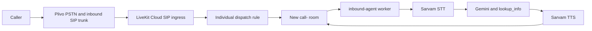

# AI Clinic Receptionist: product architecture

Audit date: 2026-09-17. Status: **Phase 0 complete; proposed design, not an implemented product**.

This is an administrative assistant, not a medical device, clinical decision-support system, diagnostic service, or triage service. The requirements in [the product specification](../.github/copilot-instructions.md) govern implementation. An appointment request confirmed by the caller is **not** a confirmed appointment.

## 1. Verified current architecture

### Repository inventory

| Existing file | Responsibility |
| --- | --- |
| [src/agent.py](../src/agent.py) | Voice providers, generic business prompt, demo knowledge, one tool, worker lifecycle |
| [src/__init__.py](../src/__init__.py) | Package marker |
| [pyproject.toml](../pyproject.toml) | Python requirement and six direct dependencies; no build/check configuration |
| [uv.lock](../uv.lock) | Dependency resolution |
| [sip/dispatch-rule.json](../sip/dispatch-rule.json) | Existing inbound trunk reference, individual room dispatch, named worker |
| sip/inbound-trunk.json (local, ignored) | Existing called number and inbound noise suppression configuration |
| [.gitignore](../.gitignore) | Secrets, local SIP configuration, environment and cache exclusions |
| [.github/copilot-instructions.md](../.github/copilot-instructions.md) | Product requirements; user-authored, not changed by this audit |

There is no first-party database, frontend, API server, migration, automated test suite, CI workflow, deployment manifest, or application README. Secret files and backups were not read. Both `.env` and `.env.bak-preplivo` are ignored by Git; their existence alone does not establish public exposure. The inbound trunk JSON is also untracked and ignored. Do not overwrite this working local configuration with template values.

### Stack and provider settings

| Component | Observed version/configuration |
| --- | --- |
| Python | Manifest requires >=3.10; selected environment is Python 3.10.19 |
| Package manager | uv with project-local virtual environment and lockfile |
| LiveKit RTC | Installed 1.1.13 |
| LiveKit Agents | Installed 1.3.11 |
| Google, Sarvam, Silero, turn-detector plugins | Installed 1.3.11 |
| Noise cancellation plugin | Installed 0.2.6 |
| python-dotenv | Installed 1.2.2 |
| STT | Sarvam `saaras:v3`; `SARVAM_STT_LANGUAGE`, default `hi-IN` |
| LLM | Google Gemini; `GEMINI_MODEL`, source default `gemini-2.5-flash`; temperature 0 |
| TTS | Sarvam `bulbul:v3`; language/speaker environment settings, defaults `hi-IN`/`shubh` |
| VAD | Silero, prewarmed per worker process |
| Turn detector | Optional multilingual model; source falls back to VAD-only |

The source header mentions Haiku, but the executable source default is Sonnet. The effective environment model was not inspected. Language-switch instructions do not by themselves prove correct STT/TTS switching; multilingual calls need regression tests. Do not upgrade unrelated provider packages during product implementation.

### Existing call path to preserve



The source connects to the room, waits for a participant, then creates an `AgentSession` and `VoiceAgent`. Native SIP detection uses `PARTICIPANT_KIND_SIP`. A legacy `telephony=true` attribute also affects audio tuning; it must **not** become an authorization signal for clinic access. The current tool is a process-global keyword lookup over four demo business topics, not vector retrieval and not clinic-approved knowledge.

Preserve worker name `inbound-agent`, explicit dispatch, greeting-after-participant ordering, Sarvam/Gemini integrations, prewarmed VAD, and telephony noise cancellation. Current telephone endpointing is 0.45–1.2 seconds; microphone endpointing is 0.21–0.75 seconds. No carrier WebSocket bridge is needed.

Deployment evidence is a local `uv run src/agent.py dev` worker connecting to LiveKit Cloud, not a reproducible always-on hosted worker deployment. Two worker parent processes were present at audit; neither was stopped. Multiple workers are supported but can make local log diagnosis confusing. Process presence does not prove registration or readiness.

Earlier configuration work used an India-pinned LiveKit SIP origination endpoint. Its live Plivo configuration was not re-fetched during this audit. Preserve it and verify in the real-call pilot rather than changing telephony resources as part of a database feature.

### Verification baseline

| Check performed | Result |
| --- | --- |
| Parse all first-party Python with `ast.parse` | Passed: two files |
| Standard-library unittest discovery under src | Completed, **zero tests**; not product coverage |
| Editor diagnostics requested for source/manifest | Manifest reports no errors; no affirmative source type-check result returned |
| `git diff --check` | Passed before modifications |
| Existing formatter/linter/type checker | No configured command; Ruff and mypy not installed |
| Existing test/build tools | pytest and build not installed; no explicit package build backend or build task |
| LiveKit hostname resolution and bounded HTTPS request | DNS resolved; HTTPS returned 200 |
| Local PostgreSQL readiness | Server accepting connections; database ownership/purpose not inspected |
| Real SIP call, agent speech, latency, interruption | **Not verified in this audit** |

The supplied terminal logs show earlier DNS failures ending after 16 retries. Current HTTPS reachability does not prove recovery of every worker. Earlier empty Plivo CDR responses were evidence, not conclusive proof that calls never reached Plivo; log delays and upstream failures need carrier evidence. No unverified provisioning-delay guarantee should be used as a diagnosis.

### Existing gaps

- Generic commercial demo facts must never answer clinic questions in product mode.
- There is no tenant resolution, database persistence, publication boundary, consent model, appointment storage, transfer tool, or administrative guardrail layer.
- `lookup_info` logs raw query text. Room/participant identifiers can also contain caller numbers. SDK debug logging needs review before handling patient calls.
- Startup exceptions are logged and re-raised; there is no application-owned deterministic spoken fallback, call-duration limit, or durable crash reconciliation.
- No recording is requested by source code; provider/dashboard recording settings were not inspected.
- Deprecated room input options are a later compatibility task, not a reason to rewrite the voice pipeline now.

## 2. Proposed architecture and smallest integration points

Retain Python/uv and the existing LiveKit agent. Add a `src/clinic/` package organized into adapters, orchestration, domain models, repositories, services, tools, safety, and observability. The agent should import a composition boundary, not database clients in every tool.

| Boundary | Responsibility |
| --- | --- |
| LiveKit/Plivo adapter | Extract trusted ingress metadata; implement verified transfer/disconnect operations |
| `ClinicResolver` | Resolve the **called** number and expected trunk into exactly one active clinic |
| `ClinicConfigurationService` | Validate drafts, preview, atomically publish, load a pinned version, rollback |
| `CallSessionService` / orchestrator | Idempotent initialization, per-call context, state transitions, shutdown reconciliation |
| `DoctorService`, `ScheduleService`, `NoticeService` | Exact, effective, version-scoped operational facts |
| `RequestService` | Confirmed-by-caller administrative requests with idempotent persistence |
| `KnowledgeService` | Published FAQs; later reviewed clinic/version-scoped document retrieval |
| `TransferService`, `ConsentService` | Policy-bound handoff and explicit profile-consent lifecycle |
| `UsageService`, `AuditService` | Sanitized accounting, budgets, append-only administrative evidence |
| Dashboard/API | Supabase authentication, server authorization, previews and publication |

Use PostgreSQL hosted by Supabase for data, Supabase Auth for users, and private Supabase Storage for documents. Use an async psycopg pool for controlled parameterized SQL behind repositories. Choose current stable new packages compatible with Python 3.10 and the locked voice stack, and record them in uv; no broad dependency upgrade.

No web framework exists. The least disruptive dashboard is one Python FastAPI application with server-rendered Jinja templates and small progressive-enhancement JavaScript. It shares domain services with the agent without importing provider initialization. A second Node/React/Next backend is unnecessary. Authentication, role checks, CSRF protection and responsive accessible UI are required even for the minimum dashboard.

Integrate at three points only after offline gates pass:

1. After `ctx.connect()` and validated participant arrival, resolve clinic and open a session with its published snapshot.
2. Construct a clinic agent using the existing voice-provider settings and per-call typed tools instead of the demo `lookup_info`.
3. Attach bounded lifecycle, usage and error callbacks with durable finalization/reconciliation.

Keep the current POC unchanged until the new mode passes database and safety tests. Introduce an explicit deployment-wide product-mode setting for controlled pilot rollout. In product mode, unknown routing, missing configuration or database failure must fail closed; **never fall back to generic demo knowledge**. A rollback must not silently send real clinic callers to the generic business assistant.

## 3. Database model and migration strategy

Use ordered SQL migrations under `supabase/migrations/`, development-only seed scripts, and separate integration-test databases. Never apply a migration or seed to an unspecified/existing production database. Do not derive a default database connection from the local machine's existing PostgreSQL service.

All primary keys are UUIDs. Event timestamps use `timestamptz` in UTC; each clinic has a validated IANA timezone. Use half-open effective intervals `[from, until)` and validate their ordering. Weekly local times are interpreted in the clinic timezone, with explicit DST ambiguity/nonexistence handling. Resolve “tomorrow” from backend current time in that timezone, not the LLM's assumed date.

Every tenant-owned row has non-null `clinic_id`. The root `clinics` table uses its own `id` as the tenant key. Each referenced tenant entity exposes `UNIQUE (clinic_id, id)` and child tables use composite foreign keys; RLS alone must not allow cross-tenant doctor/service/location references. Default to restrictive deletion for history; explicit privacy erasure anonymizes sensitive fields while preserving non-sensitive audit evidence according to retention policy.

| Entity | Required fields and constraints beyond common UUID/clinic/timestamps |
| --- | --- |
| `clinics` | Unique slug; name, timezone, default/supported languages, status; greeting/emergency/fallback; transfer policy and protected target; call/usage limits; active configuration reference |
| `clinic_users` | Supabase auth user reference; unique clinic/user membership; constrained owner/manager/receptionist/viewer role and active/inactive status |
| `phone_numbers` | Provider, validated E.164, provider reference, direction capabilities/status; unique active inbound assignment per number; trusted trunk binding |
| `locations` | Public address/landmark/directions/map/parking; status and effective dates |
| `doctors` | Public display/normalized names, aliases, specialty, languages, public bio, accepts-new-patients flag, status/effectivity |
| `services` | Normalized name/aliases, approved description, appointment requirement, active/effectivity |
| `doctor_services` | Composite clinic/doctor/service references; decimal fee >=0, ISO currency, status/effectivity; prevent overlapping conflicting fee intervals |
| `weekly_schedules` | Optional doctor for clinic hours, required location, weekday 0–6, valid start/end, availability type/effectivity; split overnight periods explicitly |
| `special_date_schedules` | Explicit date-specific opening hours, doctor/location scope, publication/effectivity; separate from weekly schedules |
| `schedule_exceptions` | Date or bounded datetime, optional doctor, location, available/unavailable/modified state, valid times, public message, private internal note, publication and author |
| `temporary_notices` | Optional location/doctor/service scope, type, public/private text, required start/expiry, priority, author/publication; expiry later than start |
| `approved_faqs` | Category, canonical/alternate questions, approved answer, effectivity, author/publication |
| `configuration_versions` | Unique clinic/version number, draft/published/superseded/archived, schema and prompt versions, immutable runtime content, publisher/time; no update to published content |
| `caller_profiles` | Optional consented administrative convenience only; protected normalized phone/name, keyed phone lookup hash, language, consent/confirmation/retention timestamps |
| `consent_events` | Append-only grant/deny/withdraw records with consent type, notice version, session and optional profile references |
| `call_sessions` | Number, provider call key and LiveKit room references; protected caller/profile; pinned configuration; lifecycle/timing/language/intent/disposition; transfer/safety/error; sanitized summary/cost/retention |
| `call_events` | Append-only session event type, allowlisted sanitized payload, occurrence time; no raw transcript |
| `appointment_requests` | Session/profile, protected caller-confirmed name/contact, new/existing patient, clinic-scoped doctor/service, preferred date/time, status, staff-only note; agent may only insert `new` |
| `callback_requests` | Session/profile, protected minimum name/contact, requested time, bounded administrative reason category, status |
| `knowledge_documents` | Private storage path, original filename/MIME/category/checksum, processing/review/publication state, effectivity/version/supersession, extraction reference, reviewer/publisher |
| `document_chunks` | Document/version/chunk index, content, embedding/model version, metadata, publication/effectivity; composite clinic/document references |
| `usage_records` | Session, telephony duration, STT/LLM/TTS units, estimated component costs/currency/rate version; unique event keys against duplicate ingestion |
| `audit_logs` | Append-only clinic, verified actor, action/resource, allowlisted safe changes, timestamp and correlation ID; exclude secrets and raw PII |

Index clinic/status and clinic/effective-date predicates, normalized names, call start/disposition, new requests, and child foreign keys. Name normalization is Unicode-aware; aliases do not make a surname globally unique. Validate schedule/fee conflicts transactionally and use exclusion constraints where interval models permit them. Validation must cover nullable clinic-level scopes explicitly rather than relying on SQL NULL uniqueness semantics.

Provider idempotency keys include provider/account scope and provider call ID; a retry must reuse the existing session and pinned version. Use a trusted LiveKit call identifier when the carrier ID is unavailable, not a caller-supplied arbitrary string. Request creation has a session-bound idempotency token and unique constraint; a retried response must not create a second request.

Do not cascade clinic/user/config deletion into calls, requests, consent, fee history or audits. Distinguish account deactivation, content archival and privacy erasure. Append-only records reject application UPDATE/DELETE; a separately authorized retention process performs documented redaction/deletion. Platform-wide security events belong in a separate restricted store, not tenant rows with nullable clinic IDs.

### Tenant isolation and authorization

- Enable RLS on every tenant table. Use active `clinic_users` membership via verified Supabase `auth.uid()` for dashboard reads and role-limited writes. Prevent users from self-creating memberships or promoting their roles.
- Use server authorization for every operation as well as RLS. Owner/manager manage configuration and users; receptionist manages requests and permitted operational drafts; viewer is read-only. Publishing and staff confirmation require explicit privileges.
- Platform administration uses a separate server-verified platform role, not a caller-selected clinic or editable user metadata.
- A trusted ingress resolver has only the ability to map approved number/trunk assignments; the voice runtime cannot browse all clinic data. After resolving, bind a clinic-scoped repository to the call.
- Prefer a non-owner, non-`BYPASSRLS` runtime DB role. Any transaction-local tenant context is set only by trusted backend code after ingress validation; it is not an authenticated user credential and must never be set from tool arguments. Reset context via transaction scope to avoid pooled-connection leakage.
- Restrict privileges to parameterized repositories or narrowly granted functions. Fix `search_path` and revoke public execution for security-definer functions. Service-role/owner credentials bypass RLS and must not be used as evidence that RLS works.
- A Supabase service key, if needed for trusted administration/storage, stays server-side; do not use it for ordinary unscoped dashboard queries.
- Dashboard sessions identify users, not clinics. A selected clinic is checked against active memberships on every request. Cache keys include clinic, configuration version, and applicable date/time.
- Phone resolution uses trusted **destination/called number**, not `sip.phoneNumber` (caller number), SIP From, spoken clinic names, or LLM arguments. Validate provider trunk expectations and deny missing, ambiguous, inactive or conflicting mappings.
- Existing arbitrary participant attributes are unsuitable for tenant authorization. Microphone test sessions require authenticated, server-issued preview context; a public room cannot choose a clinic.
- Storage object paths begin with a validated clinic UUID and have RLS-backed authorization. Retrieval enforces clinic, pinned document membership, publication and effectivity inside SQL, before LIMIT/ranking results leave the DB.

## 4. Publication, snapshots, and knowledge precedence

Authoring rows are drafts; runtime tools must not read mutable authoring tables directly. Publish creates a typed, immutable, public-only snapshot in PostgreSQL (or immutable version-indexed relational projections) containing operational facts and references to approved document versions. All operational tool reads include the call's `configuration_version_id` and `clinic_id`. Merely copying clinic settings while querying mutable schedules is **not** snapshot isolation.

Publication transaction: authorize publisher, lock the clinic row, validate all referenced data and conflicts, allocate version number, materialize public data, mark prior publication superseded, set active pointer, append audit, commit. Preview uses a separately identified draft version and never mutates the production pointer. Rollback publishes a new version of earlier content with new provenance; old sessions remain reproducible.

Pinned versions are not necessarily still marked `published`: an active call must continue to use its authorized version after it becomes `superseded`. New calls only load the active published pointer. Expiry is evaluated against current/requested time within the pinned content; publishing must not inject newly added facts mid-call. Archived/revoked documents are conservatively withheld even if formerly referenced; that removes access rather than substituting new answers. Legal/safety takedown can end or restrict a session but must not silently replace its knowledge version.

Validate clinic hours, timezone/languages, emergency text, schedule overlaps, fee intervals, all references, notice expiry, transfer number/hours, document extraction status, and prohibited/private text before publication. Public snapshots exclude internal notes and staff request notes by construction, not by a prompt instruction.

Order of precedence:

1. Effective emergency/manual operational override within the pinned configuration.
2. Active temporary notice.
3. Date-specific schedule exception.
4. Special date schedule.
5. Effective weekly schedule.
6. Effective structured clinic facts.
7. Approved FAQ.
8. Published, clinic-scoped approved administrative document.
9. Transfer or explicit absence of confirmed information.

Clinic closure overrides a doctor's normal schedule. Fees come from structured effective fee records. Availability is published working time, **not inventory of bookable slots**. Medical emergency wording is an approved deterministic safety response, not an availability calculation or clinical assessment.

## 5. Agent/tool flow and session state

```mermaid
sequenceDiagram
    participant SIP as Trusted SIP ingress
    participant O as Call orchestrator
    participant DB as Scoped PostgreSQL services
    participant A as Existing LiveKit voice pipeline
    SIP->>O: Called number + trunk + call identifiers
    O->>DB: Resolve active clinic; create/reuse session
    DB-->>O: Pinned configuration and call context
    O->>A: Per-call prompt, tools, existing providers
    A->>O: Caller intent and validated typed arguments
    O->>DB: Parameterized clinic/version-scoped operation
    DB-->>A: Caller-safe structured result
    A-->>SIP: Brief grounded response
    O->>DB: Persist disposition, usage and session close
```

`CallContext` contains session/clinic/phone/config IDs, timezone, supported languages, protected caller reference, provider/room IDs, start time, pending/unconfirmed fields, consent, language and transfer state. No state is shared between calls. Clinic scope is constructed server-side and absent from every model-visible tool signature.

Tools return a consistent typed envelope: `status` (`success`, `not_found`, `ambiguous`, `unavailable`, `forbidden`, `failed`), caller-safe `data`, and safe `next_action`. Internal metadata remains outside the model-facing serialization. Validate length, enums, names, dates, timezone, contact number and clinic-bound references before queries; the LLM never writes SQL or supplies identifiers to bypass scoping.

| Typed tool | Required backend behavior |
| --- | --- |
| `get_current_clinic_status` | Effective clinic/location hours and public notices, closure precedence, timezone/reason |
| `find_doctors` | Normalized/alias search; active/effective only; explicit ambiguity requiring clarification |
| `get_doctor_availability` | Resolve doctor, date/time preference/location; apply exceptions, special/weekly schedules and clinic closure |
| `get_service_information` | Approved service/description, appointment requirement, associated doctors and effective fees |
| `get_consultation_fee` | Current structured fee or explicit missing/ambiguous result |
| `get_clinic_location` | Current public address, directions and optional map URL |
| `search_approved_knowledge` | Administrative-only published passages, source references, tested threshold; insufficient information otherwise |
| `create_appointment_request` | Server-validated readback/confirmation state; persist only `new`, idempotency and reference; clinic must confirm appointment |
| `create_callback_request` | Same confirmation safeguards; minimum contact and reason category |
| `transfer_to_reception` | Policy/transfer-hours check; bounded provider operation and honest outcome; callback on recoverable failure |

Do not treat a model-generated `confirmed=true` as proof of caller consent. The orchestrator retains a pending request, records the assistant readback, and requires a subsequent caller confirmation tied to those exact fields; corrections invalidate the previous confirmation. Uncertain transcription requires another readback. A future booking integration is outside scope.

Use versioned sanitized prompt templates. Identify as automated, use supported languages, require tools for exact facts, prohibit medical advice and hidden data disclosure, and keep replies short. Approved clinic messages are bounded configuration data, not arbitrary instructions. Neither documents nor callers can change rules, clinic scope or authoritative facts.

## 6. Safety, privacy, and reliability

Layer input classification/routing, tool authorization, public-only data serialization and output safeguards around the prompt. Deterministically intercept known diagnosis, medication/dose, lab interpretation, treatment, emergency/self-harm, injection and credential/data-exfiltration requests, with conservative fallback for uncertain medical language. Multilingual keyword detection alone is not comprehensive; test English, Hindi and transliteration, including false positives. Do not claim this is clinical triage.

Medical requests receive approved refusal/emergency wording and allowed human handoff, never a clinical answer or reassurance of harmlessness. Do not solicit detailed symptoms. If a caller volunteers medical content, do not persist it in ordinary transcripts, summaries, tool payloads, analytics or logs. Administrative summaries use constrained intents/results, not unconstrained transcript summarization.

Recording defaults off in application and provider configuration. Returning-caller recognition is optional and off initially; caller ID is not verified identity. Reuse only minimal profile fields after explicit consent, with withdrawal/correction/deletion and expiry. No clinical memory or voiceprints.

Protect names/contact fields with authenticated application encryption and versioned keys stored outside the DB; phone lookup uses a keyed HMAC with clinic separation, not a plain phone hash. E.164 clinic routing numbers are operational configuration, not caller identity. Mask contact information in dashboard lists; authorize staff-only detail access. Never emit secrets, raw user text, full caller numbers or number-bearing room names into routine logs.

Use TLS for database/API traffic, private storage and short-lived authorized download URLs. Existing SIP transport/media security needs an explicit provider compatibility review; do not assert that TCP implies encryption. Restrict SIP ingress to verified provider addresses/authentication after compatibility testing. Previously disclosed credentials need rotation through secret management, not chat.

Timeout and lifecycle design:

- Bound database connect/query/pool waits, provider calls, tools, startup, silence and overall call duration. Retries only for safe/idempotent operations with bounded jitter and deadlines.
- Install disconnect/shutdown finalization and periodic durable heartbeats. Reconcile expired running sessions after crashes; `finally` alone is not crash persistence.
- Pre-render reviewed fallback audio for database, STT/LLM/TTS, transfer and silence failures. A TTS outage cannot be handled by asking the same unavailable TTS provider to speak. Carrier/ingress fallback is needed if no agent joins at all.
- Verify the installed LiveKit SIP transfer API and Plivo behavior before enabling transfers. A REFER acceptance is not proof that a receptionist answered; some transfers release the original leg. Keep transfer disabled until actual success/failure signaling and recovery are tested. Offer a callback if safe recovery is unsupported.
- Enforce per-clinic concurrency, transactional budget reservations, maximum call duration and rate limits. Reconcile estimated usage and costs with provider records; preserve rate version and currency.
- Health/readiness reports dependency readiness without secrets, while correlation IDs link sanitized logs/metrics/audit. Export provider failure, tool latency, dispatch, unresolved-call and safety metrics.
- Retention jobs cover database PII, storage objects, obsolete extracted text and backups. Restrict privileges and audit redaction/deletion without retaining deleted personal content in audit diffs.
- Supabase auth uses verified JWT issuer/audience/signature/expiry and protected sessions. Use HttpOnly/Secure/SameSite cookies where applicable, CSRF tokens and origin checks for state-changing browser requests, and rate-limited login/API operations.
- No platform training use of clinic/caller data; vendor retention/training terms must be checked before a real clinic pilot. No compliance certification is implied.

## 7. Dashboard and document retrieval

Dashboard authorization is server-side for every page/query/action, including preview, exports and document downloads. Platform administration is distinct from clinic membership. Implement responsive Today, Doctors, Services, Schedule, Notices, Knowledge, Requests, Calls, Review queue, Agent test and Settings pages incrementally. Today presents published effective facts and clearly labelled draft changes. Every temporary change has a start and expiry. Draft preview/test sessions are marked and excluded from production usage reports.

Publication is an explicit action, never an incidental save. Staff can manage request statuses including `confirmed_externally`; the voice runtime cannot. Keep private notes outside caller-facing views and tool payloads. User-role changes, publishing, rollback, requests and sensitive access produce sanitized audits.

Document retrieval is **Phase 5, after structured tools work**. Validate size/MIME/content and restrict formats; quarantine uploads for security scanning and bounded text extraction in an isolated worker. If scanning is only a placeholder, block production publication rather than mark uploads safe. Use private clinic-prefixed storage, checksums for within-clinic deduplication, normalization, extracted-text preview and reviewer approval. Do not publish on upload.

Embeddings require an explicit provider/model/region and data-processing decision; record dimension, model version, chunk strategy and threshold evaluation. Use Supabase pgvector plus metadata/full-text filters if supported. Keep source/version/publication/effective filters inside the query with tenant predicates. Source documents cannot provide doctors, fees or schedules in preference to structured data.

Replacement creates a new document version; atomically publish approved new chunks and archive/revoke old retrieval eligibility. Configuration versions retain document provenance. Return insufficient information below a measured relevance threshold, and include source IDs for internal diagnosis rather than reading them to callers.

## 8. Implementation phases and acceptance gates

| Phase | Deliverables | Gate before next phase |
| --- | --- | --- |
| 0 — Audit | This inventory, baseline, architecture and decisions | No voice/SIP changes; verification limitations explicit |
| 1 — Database/tenancy | Dedicated dev Supabase/Postgres target; migrations, roles/RLS, scoped repositories/resolver, two-clinic seeds | Real DB tests under non-owner roles; unknown number fails closed; no production mutation |
| 2 — Structured knowledge | Effective facts/precedence, matching, immutable publication, typed tools | Unit and real-DB tool tests; draft exclusion, pinned reads, cross-clinic constraints |
| 3 — Sessions/requests/safety | Orchestrator, prompt, confirmation, persistence, fallback/transfer, guardrails/usage | Lifecycle/crash/idempotency/safety tests; deliberate pilot integration with unchanged audio providers |
| 4 — Dashboard | Auth/RBAC, Today and management pages, preview/publish/rollback, requests/calls | API/UI role tests, CSRF/session tests, no service key in browser |
| 5 — Knowledge documents | Private upload, extraction/review, embeddings/pgvector, supersession | Real RLS/vector isolation, relevance tests, malicious upload/document tests |
| 6 — Hardening | Monitoring/readiness, retention, concurrency/budgets, deployment/rollback docs | Pilot checklist and failure tests; no unresolved release-blocking gaps |

After each phase: format, lint, type check, relevant unit/integration tests and build; report exact results, changed files, migrations and limitations. Add minimal pytest, Ruff, mypy and build configuration because none exists. Freeze the provider lock baseline; review every dependency diff. Do not call skipped DB/provider tests passing.

Phase 1 seeds use at least two explicitly fictional clinics with overlapping doctor surnames and different schedules/fees. One includes two doctors, three services, weekly hours, doctor leave, expiring closure, FAQ, approved sample document and fictional calls/requests. Fixtures may use isolated synthetic routing identifiers, never the working phone number or real patient data. Deployment phone assignments come from authorized environment/setup input, not source constants.

Tests must cover doctor ambiguity, clinic timezone dates, all precedence levels, fee effectivity, notice expiry, clinic closure, draft exclusion, archived chunks, argument validation, request-only status, medical refusal, maximum call duration, consent and snapshot stability. Run SQL isolation with real Supabase auth roles and two users, not only mocked repositories or service keys. Test cross-clinic read/write/foreign-key/API/storage/vector denial, caller scope injection and inactive/unknown numbers.

Integration coverage: session initialization, controlled tool SQL, request persistence, duplicate call/provider events, transfer confirmed success vs failure and callback, dependency outage fallback, disconnect finalization and crash reconciliation. Test publishing during an active call and pooled-connection tenant context under concurrency.

Conversation fixtures include all 15 specified scenarios: tomorrow-evening availability, ambiguous surname, leave, holiday closure, appointment-confirmation demand, medicine request, possible emergency, cross-clinic inquiry, prompt injection, Hindi/English switching, interruption, failed transfer, unknown administrative question, declined profile reuse and corrected language preference. Assert tool invocation, forbidden claims and dispositions; deterministic fixtures alone do not certify real voice behavior.

Pilot gate: at least 50 documented calls spanning Hindi, English, mixed language, noise, silence, barge-in, concurrency, disconnect, SIP failure, database outage, long calls, unknown names and transfer behavior. Run under approved retention/consent settings without unnecessary recording. Verify both fictional clinics and new-publication/active-call stability before exposing real clinic data.

Developer documentation will include `.env.example` placeholders, local setup, dedicated Supabase provisioning, migrations/seeding, pgvector, dashboard/test startup, LiveKit/Plivo placeholders, pilot limitations, production versus experimental capabilities, deployment and rollback. An always-on worker needs supervised restart and readiness; a local development terminal is not a production deployment. Database rollback should prefer safe forward repair; configuration rollback republishes a version without rewriting call history.

## 9. Assumptions and unresolved decisions

1. **Phase 1 environment selected (2026-09-17):** the user selected a dedicated Supabase Cloud development project. Connection and initially empty public schema were verified; Phase 1 migrations and fictional fixtures are now applied. Region/vendor approval for production remains pending. Do not reuse a production project or the existing local PostgreSQL service. Credentials stay in ignored configuration; the new data package is not integrated into the voice worker. See [Phase 1 results](phase-1-database.md).
2. **Called-number trust:** inspect real inbound SIP metadata and verify the destination attribute/trunk binding before enabling clinic mode. Current code only reads the caller number. Missing authoritative destination must reject initialization, not guess a clinic.
3. **Call-health discrepancy:** the supplied spec says real calling works; earlier conversation reports failed calls and terminal DNS failures. Preserve the route, but require a fresh successful pilot call as evidence. This document does not certify its current end-to-end health.
4. **Clinic approvals:** actual emergency text, transfers/hours, languages, privacy notices and retention must be clinic-approved. Fictional development data cannot stand in for production approval.
5. **Transfer semantics:** no transfer implementation exists. Verify installed SDK signatures and provider outcomes; keep disabled until failure recovery is demonstrated.
6. **Embedding and extraction vendors:** defer paid/vendor selection until Phase 5; clinical/patient records are outside retrieval scope.
7. **Hosting and jurisdiction:** confirm data region, provider agreements, production secret management, backup retention and always-on hosting before real clinic rollout.
8. **Safety revocation versus snapshot pinning:** ordinary publications only affect new calls. Emergency/legal access revocation may withhold content or stop a call, never silently replace its pinned facts; approval of this operational policy is required for deployment.
9. **Scope exclusions:** no calendar/CRM/WhatsApp/payment/EHR/prescription/insurance/triage/mobile/outbound-campaign implementation. The product is incomplete until every completion gate in the specification is demonstrated.

## 10. Phase 2 implementation status

Phase 2 implements version-2 public snapshots, membership-checked preview/publish/
rollback, structured effective facts and seven typed LiveKit tools. See the
[Phase 2 report](phase-2-knowledge.md) for publication semantics, legacy snapshot
compatibility, tests and limitations. No voice-agent/SIP integration was enabled.
Phase 1 seed publications remain immutable version 1; new tools deliberately
require an explicit version-2 publication. Phases 3–6 remain pending.

## 11. Phase 0 change record

The initial audit added only this architecture document. Following the user's environment selection, `.env.example` was added with placeholder settings. At the end of Phase 0, no agent source, dependencies, secrets, SIP resources, running workers or database schemas had been changed, and no migrations had been applied. Phase 1 subsequently added the isolated data foundation; its changes, verification and remaining gates are recorded in [Phase 1 results](phase-1-database.md). Phase 2's separate record is linked above; phases 3–6 remain pending.